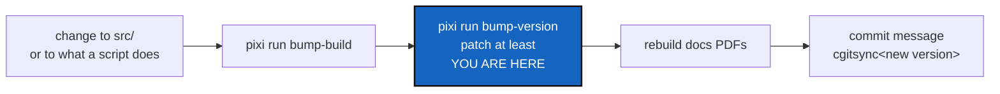

# Versioning — how this project numbers what it releases

*Created: 2026-09-22*

## Abstract — read this first

**The one-line version.** ComplexGitSync carries two numbers: a SemVer
that says what each release promises, and a build counter that says which
build wrote a ledger entry. Every build bump is followed by a version
bump, `patch` at least, and nothing automatic ever writes either.

**What this document is.** The versioning rule for this project: what
SemVer measures here, the two numbers and when each moves, who bumps
what, the `bump-version` and `bump-build` commands, and the release
register.

**Why it exists.** A version is a promise to the people who use the
tool, so moving it is a judgement a reader makes. The rule must be
written down in one place, or agents follow whatever they assume, as they
did until 2026-10-02.

**What you will find.** The sections below, in that order.

**Who it is for.** The worker who changes `src/`, the orchestrator who
chooses the release level, and the owner.

**What you need to do with it.** After any `bump-build`, run
`bump-version` before calling the work done, then rebuild the PDFs and
write the commit message with the new version.

---

## Versioning

`DevSpecs.md`'s *Versioning* section leaves the choice between calendar
`YYYY.XX` and SemVer to each project, against a stability promise. This
project chooses **real SemVer** (`MAJOR.MINOR.PATCH`, with an optional
`-<stage>.<N>` pre-release suffix), authoritative in `pyproject.toml` —
because it publishes a package under exactly the promise SemVer exists to
state (see *What SemVer measures here*, below). **No workflow writes it.**
`.github/workflows/ci.yml` has never auto-incremented anything — it
installs, reconstitutes the tree, lints, and tests, and nothing more. A
version bump is a release decision, made by a reader, not a byproduct of a
push — the general rule `DevSpecs.md`'s *Versioning* section and the
`dev-sync` skill's `AgentConduct.md` §1.3 both state.

### What SemVer measures here

SemVer's positions are defined against a public API, and this project
already has one written down: README's *What is stable, and what is not*
table.

| Position | Increments when | From the CLI contract |
|---|---|---|
| **MAJOR** | The public interface breaks | A command or documented flag is removed or renamed; an exit code changes meaning; a `--json` field is repurposed or removed; a `.cgs`/`.gts` grammar change an older reader cannot load |
| **MINOR** | Capability is added, compatibly | A new command, a new flag, a new `--json` field, a new provider — everything the contract calls "additive only" |
| **PATCH** | Behaviour is fixed, nothing added | A bug fix with no interface change |

Two things this narrows a great deal: `src/ComplexGitSync/` is **not a
public interface** (the contract says so outright — an internal refactor
never forces a major bump and owes no deprecation), and `verify` is
**experimental**, so its output changing is not a break either, until it
stops being.

Pre-release identifiers (`3.1.0-alpha.1`, `3.1.0-beta.2`, `3.1.0-rc.1`,
then `3.1.0`) are SemVer's own answer for a release still in progress —
sorting correctly by specification, understood by every tool already, and
what `pixi run bump-version`'s `--pre`/`--release` flags produce.

### Two numbers, two cadences

| Number | Where | Moves when | Says |
|---|---|---|---|
| **SemVer** | `pyproject.toml`, `pixi.toml`, `src/ComplexGitSync/__init__.py`'s `__version__` | Every time the build counter moves (at `patch` at least), and on a release that changes no code | What the project promises |
| **Build counter** | `src/ComplexGitSync/__init__.py`'s `__build__` | Every change to `src/`, automatically as part of that change | Exactly which build produced a given ledger entry |

**Every build is released.** A change that runs `bump-build` also runs
`bump-version`, at `patch` at least, in the same change (owner,
2026-10-02). A change outside `src/` that still changes what a command
or script of this repository does (`scripts/`, a pixi task) is released
the same way, at `patch` at least, though it has no build to bump. The
build counter never moves without the SemVer.
The reason is that a fix folded into a version that was already quoted
is invisible: its version still names the work before the fix, and the
owner wants every fix to be a release a reader can name. The build
counter keeps the calendar scheme the whole package
used to follow (`YYYY.XX`, `XX` rolling 01→99 into `YYYY+1`) — it is
provenance, never identity, and (like every toolchain version) never enters
a State's hash. See *What a State's name is computed from*, below.

### Who bumps what

| Who | Does | With |
|---|---|---|
| **Worker** — the agent changing `src/` | Bumps `__build__`, as part of that change — then `bump-version patch` itself when no orchestrator quotes the work | `pixi run bump-build` (`scripts/bump_build.py`) — writes one file |
| **Orchestrator** — independent, quotes the work | Decides MAJOR/MINOR/PATCH (never below PATCH when the build moved), runs `bump-version`, tags, writes the release row | `pixi run bump-version {major,minor,patch} [--pre <stage>] [--release]` (`scripts/bump_version.py`, this skill) |
| **CI** | Verifies: lint, tests, tree reconstitution | Never writes a version; needs no credentials to |

**`bump-build` is never the last versioning step.** In order: `bump-build`,
then `bump-version` at the level the change deserves (`patch` at least),
then the PDF rebuild, then the commit message, which reads the new version.
Three cases agents got wrong before this rule was written down:

- **A follow-up fix to a version not yet committed still gets its own
  patch.** A review's fixes after 3.14.0 are 3.14.1, not "more of 3.14.0".
- **No orchestrator does not mean no bump.** When the owner asks for a fix
  directly and no orchestrator quotes it, the worker runs
  `bump-version patch`, the floor. A change that adds a command or a
  flag still deserves `minor`; the worker says so in its report rather
  than deciding it alone.
- **"Patch" from the owner means this rule.** It means `bump-build`, then
  `bump-version patch`, never "amend the version already there".

**CI cannot make the MAJOR/MINOR/PATCH judgement** — no diff distinguishes
a renamed flag from a new one — so it never runs `bump-version`, and it is
never asked to: `bump-version` needs a reader present, and CI is present at
the push, not at the change. This is a frontier, not a preference: CI's
`permissions: contents: read` never changes for this.

**The build counter is bumped by the worker, not derived, and not by
CI.** A number derived from git history (`rev-list --count`) would need no
credentials either, but it would also leave no act to check — an
orchestrator quoting a change can see whether `bump-build` ran (it shows in
the diff) and cannot see whether a number "should" have moved. A visible
act beats an invisible automatism when the whole point is accountable
agent work.

### `bump-version`

Reads the current version from `pyproject.toml`, and writes the version the
caller names — **five targets**:

| File | Field |
|---|---|
| `pyproject.toml` | `[project].version` — the authoritative one |
| `pixi.toml` | `[workspace].version` |
| `src/ComplexGitSync/__init__.py` | `__version__` |
| `README.md` | the version in the title heading (`v<semver>`) |
| `docs/Setup/Shortcuts.tex`, `docs/preamble.tex` | `\newcommand{\cgsversion}{...}` |

Exactly one of a bump level or a pre-release action is required —
`major`/`minor`/`patch` (bumps that position, drops any pre-release
suffix), `--pre <alpha\|beta\|rc>` (alone, advances an existing
pre-release; combined with a level, starts a new pre-release cycle at
`.1`), or `--release` (finalises a pre-release into its base version).
`--dry-run` previews the `old -> new` transition without writing anything.

**The bump is all five files or none of them.** The version is one fact; a
run that wrote three manifests and then failed on the docs would leave the
package claiming a release its documentation has never heard of, and would
do it quietly enough that the release still looked finished. So
`apply_version()` reads and rewrites every target in memory first, and only
a complete set of new texts reaches the disk. A missing file, an unwritable
one, or a version field the patterns cannot find stops the whole bump with
nothing changed.

The last two live in `docs/`, a separate repository (`DocComplexGitSync`).
When they are absent — a checkout of `ComplexGitSync` alone — the script
dogfoods `cgitsync initialise examples/complexgitsync4dev.cgs` to clone them
into place, *before* the first write rather than after three of them.
Working on this repository from a standalone checkout is legitimate;
releasing from one is not, which is why `tests/unit/test_bump_version.py`
skips its two docs checks there instead of failing. Those checks assert both
that each `\cgsversion` macro is still reachable by the script's pattern and
that its value equals `pyproject.toml`'s — matchability alone let 2.49 ship
with its documentation left on 2.48.

`bump-version` rewrites `.tex` sources only. The tracked PDFs in `docs/`
embed the version on their title pages, so after every `bump-version`
rebuild `MASTER.tex` and **every** `c_*.tex` (`cd docs && latexmk -pdf
MASTER.tex c_api_python.tex c_architecture.tex c_getting_started.tex
c_user_guide.tex`), not only the ones whose text you changed, and commit the
result in the same change. This paragraph is the one statement of the rule;
`CLAUDE.md` step 5 points here.

`bump_version.py` is orchestrator tooling and lives in this skill's own
`scripts/` — private, not in the public `ComplexGitSync` repository — so
a public-only checkout structurally cannot cut a release. It is not in a
shared, project-agnostic skill either: every target path it touches
(`pyproject.toml`, `src/ComplexGitSync/__init__.py`, `docs/Setup/`, ...)
is specific to this project.

### `bump-build`

Writes exactly one file: `src/ComplexGitSync/__init__.py`'s `__build__`.
`scripts/bump_build.py`, same `--dry-run` convention as `bump-version`. This
is a worker step, run alongside a change to `src/` — see `CLAUDE.md`'s
before-committing checklist. It is always followed by `bump-version`, at
`patch` at least (*Who bumps what*), and the script prints that next step
so it cannot be missed.

### The release register

The release register the owner asked for is the Ledger: a release is one
ledger entry carrying an additive `release` field (`memory/ledger_entry.py`
— see *The hash-chained ledger*, below, for the field's schema), written
automatically by `ComplexGitSyncClient.freeze_release()` from the currently
installed `__version__`/`__build__` and the release tag name the caller
gave it. Tamper-evidence is then free: the field is inside the same hash
chain as every other field, so a release row cannot be edited afterwards
without breaking the chain from that point on. A version never enters a
State's hash (see *What a State's name is computed from*) — a release row
only ever cites a State by id, alongside it in the ledger, never inside it.
